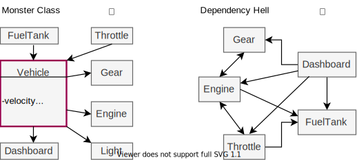
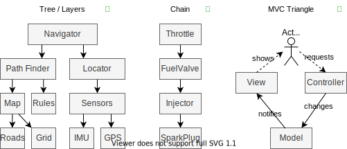

&nbsp;
# C³: Common Coding Conventions

The goal of these conventions is to be concise, universal, and remarkable. It targets emerging code enthusiasts under time pressure and covers 7 topics:

  1. [General Clarifications](#user-content-general-clarifications), 
  2. [Architecture](#user-content-architecture), 
  3. [Implementation](#user-content-implementation), 
  4. [Naming](#user-content-naming), 
  5. [Code Layout](#user-content-code-layout), 
  6. [Documentation](#user-content-documentation), and 
  7. [Languages](#user-content-languages). 

To follow this guide, you should already have heard about [Object Oriented Programming](https://www.educative.io/blog/object-oriented-programming) and know basic programming rules, such as writing loops and meaningful functions instead of copy pasting
instructions. In this Readme, we will shortly summarize the most important rules for every topic. 

Since our brains are sieves, try to remember the underlying philosophy of this guide:

> Keep it simple and solid, let the toolchain be smart,  
> code correctness is the duty, readability the art.


&nbsp;
## [General Clarifications](#user-content-general-clarifications)

### Be consistent with the existent.

"Consistency with this guide is important. Consistency within a project
is more important. Consistency within one module or function is the most
important" [PEP8].


### Break rules if it enhances clarity. 

Do not blindly follow this guide but think for yourself. The goal of
software development is keeping the code complexity low. Period. None of
the fancy patterns matters if the code becomes impossible to maintain.


### Leave code cleaner than you found it.
We all have seen bad code, we all have written bad code. Code tends to get messy by itself.
Therefore, do not only complain about bad code but improve it if you know how. If *you* don't care to do it, why should anyone else?


### Terminology

To be universal, we group several concepts under these broad
identifiers:


 * **Scope**       = {Module, File, Namespace, Subprogram}                
 * **Subprogram**  = {Procedure, Function, Method}
 * **Type**        = {Primitive, Collection, Struct, Class, ...}   
 * **Collection**  = {Array, List, Tuple, Dict, Map, ...}


&nbsp;
## [Architecture](#user-content-architecture)


To manage complexity, divide your software into smaller parts (scopes)
such as modules, classes, and subprograms. Where to separate and where
to connect scopes is the art of good architecture.

Two common mistakes in architecture design are the creation of a monster class that has too many responsibilities and letting each class communicate with too many other classes:




Instead, limit the amount and direction of information exchange between classes and create larger architectures from the following building blocks:




### Aim for low coupling between classes.

You may have many classes but each class should communicate with as few
others as possible. If any two classes communicate at all, they should
exchange as little information as possible.


### Aim for coherent abstraction levels.

Each scope should reflect a single coherent level of abstraction that
corresponds to its hierarchy level. In your UML, abstraction should
decrease from top to bottom. In your code, the deeper you are in a call
tree, the more specific your instructions can be. Avoid state variables
at high abstraction levels.


<table>
<tr><td><strong>Bad ❌</strong></td><td><strong>Better ✔</strong></td></tr>
<tr>
<td>

```python
engine.start()
nStartUps += 1
if fuelTank.isEmpty():
  fuelGaugeUI.setRedLED()
```

</td><td>

```python
engine.start()
engine.runTest():
warnings = engine.warnings()
dashboard.show( warnings )
```

</td></tr></table>

> ⚠ **Caution:** *Mixing abstraction levels creates confusion and introduces unnecessary dependencies.*


[Read more ...](chapter/1_architecture.md)


&nbsp;
## [Implementation](#user-content-implementation)

Once you have an initial plan for the architecture, you can start
writing the code for classes and subprograms.


### Don't Repeat Yourself (DRY).

Any piece of data or logic should have a single source. 
Duplicated code is difficult to maintain and represents a missed opportunity for abstraction.
As a rule of thumb: If you repeat more than 2 statements more than 2 times, write a new
subprogram. At best, any atomic change in program logic should only
affect a single line of code.


There are two code smells that should remind you of this rule:

* **Copy & Paste:** Every time you take your mouse and mark lines with the intention to copy them, you are going to violate this rule. Instead of slightly adjusting copied lines, think about the common pattern between those lines and create a new function.

* **Repeated `if-else` and `switch-case` statements:** If you are testing the same conditions at different locations (e.g. state variables), you can abstract these differences with Polymorphism and the Strategy Pattern.


### Keep all scopes (file/class/function) small and sorted.

Define subprograms and variables in the smallest scope possible and limit
their exposure to external code. Put all declarations at the beginning
of each scope and initialize variables directly at the declaration. Do
not reuse variables in nested scopes or for different purposes.


### Express ideas in code: use domain-specific names.

Avoid magic numbers (literal numbers with unclear origin/purpose) 
but always create constants with meaningful names. 
Create new types or derive subtypes from primitives to create more
specific names, especially for physical quantities. 


**Bad ❌**
```c
double limit = 13.89;        // unit not clear
from_to(int x,  int y,
        int x2, int y2);     // vague argument names 

if (speed > limit && 
   t.h > 22 && t.h < 6){..}  // 22 and 6 are magic numbers
```

**Better ✔**
```c
MeterPerSecond limit = SPEED_LIMIT_NIGHT;
drive(Point origin, Point dest);

isNight    = (T_NIGHT_MIN < t.h && t.h < T_NIGHT_MAX);
isSpeeding = (limit < speed);
if (isSpeeding && isNight){..}
```


### Sort arguments and limit them to 0 – 4 per call.

If the argument list of a subprogram grows too long, try to combine related arguments in a
new data structure. For example, instead of passing `x`, `y`, `z`
coordinates individually, use a single vector. 


### Do not change the same variable in steps but compose once from parts.

Within a subprogram, do not modify the same variable in several steps,
e.g. by summing up an amount using `total += ...` multiple times.
Instead, call functions that return some part of the final value and
then compose the final value of these parts in one instruction at the
end. E.g. `total = partA + partB`.


<table>
<tr><td><strong>Bad ❌</strong></td><td><strong>Better ✔</strong></td></tr>
<tr>
<td>
  
```c
totalIncome = 0 
// ... long code to get contract
totalIncome += contract.salary  
// ... long code to access taxoffice
totalIncome -= taxoffice[id].tax
```

</td><td>

```c
Int totalIncome(employee){      
    salary = getSalary(employee)
    tax    = getTax(employee)   
    return (salary - tax)       
}
```

</td></tr></table>


[Read more ...](chapter/2_implementation.md)


&nbsp;
## [Naming](#user-content-naming)
Code should communicate behavior to other humans with lower complexity than the behavior it inherits. Abstracting with meaningful names is therefore most important for readability.

> ⚠ **Avoid inappropriate terms:** Many organizations discourage the use of `master/slave` due to their negative association in different cultures. See [1](https://www.drupal.org/node/2275877) and [2](https://bugs.python.org/issue34605).


### Subprograms (=Procedure/Function)
Procedures *may* return values, functions always return a value. Methods are subprograms of a class.
 * procedure names should start with a verb. e.g. `syncViews()`, `list.addItem(x)`.
 * function names should describe the result and, if suitable, its type. e.g. `time_ms(), sin(x)`
 * class methods should not repeat or include the name of the class. Define `Line.length()`, not `Line.getLineLength()`

> ⚠ **Caution:** *Single noun subprograms should be pure functions! Never let e.g. `x.length()` change a state.*


### Types (=Class/Struct/Subtypes)
 * type names should be capitalized nouns. E.g. `Integer`, `Date`, `Line2D`
 * Enums/Structs are types and named as types without a special prefix/suffix.
 * Interface names should start with a capital `I` and can also be adjectives. E.g. `IObservable`


### Variables
 * variables with a large scope *should* have long names, variables with a small scope *may* have short names.
 * collections (set, array, dict) should have a plural name. E.g. `cars`, `indices`
 * the prefix `n` or `num` should be used for names representing the total number of objects in a collection. E.g. `numCars`
 * boolean variables should start with a `is/has/can/does` prefix (e.g. `isEmpty`, `doesUseIO`).
 * write constant names in capitals. E.g `CFG_TEMPERATURE_MAX = 80.0`
 * prefix global variables with `g_`


<table>
<tr><td><strong>Bad ❌</strong></td><td><strong>Better ✔</strong></td></tr>
<tr>
<td>

```python
score_list = [0] * scores 
for idx, val in score_list:
  score_list = val + 1
```

</td><td>

```python
scores = [0] * numScores 
for idx, score in scores:
  scores[idx] = score + 1
```

</td></tr></table>


### Use word pairs (opposites, antonyms).
If you “`start`” something, you should “`stop`” it and not “`end`” it [CdCm]. 
While most opposites can be created by using `un-` or `de-` prefixes (`lock/unlock`), some are more distinct and allow code alignment:


Verb pairs with same length:

| `set` |`send` |`query` |`insert` |`attach` |`show` |`split` |`enter` |`accept`  |
|-------|-------|--------|---------|---------|-------|--------|--------|----------|
| `get` |`recv` |`reply` |`delete` |`detach` |`hide` |`merge` |`leave` |`reject`  |


<details>
<summary>👆 <strong><ins>List of further word pairs</ins></strong></summary>

Verb pairs that differ by one character are more visually distinct but still easy to align with one extra space:

|  `open`  | `read`  | `load`  | `push` | `start` | `create`  | `grant` | `hit`  | `prepend` | `empty`  |
|----------|---------|---------|--------|---------|-----------|---------|--------|-----------|----------|
|  `close` | `write` | `store` | `pop`  | `stop`  | `destroy` | `deny`  | `miss` | `append`  | `full`   |


Noun and adjective pairs with same/similar length:

| `max` |`next` |`head` |`new` |`row` |`ack` |`front` |`source` |`client` |`primary` |`leader`   |
|-------|-------|-------|------|------|------|--------|---------|---------|----------|-----------|
| `min` |`prev` |`tail` |`old` |`col` |`nak` |`rear`  |`target` |`server` |`replica` |`follower` |


</details>&nbsp;


[Read more ...](chapter/3_naming.md)


&nbsp;
## [Code Layout](#user-content-code-layout)
A clear and consistent visual appearance of your code improves readability and readability helps to understand the code.

 * Existing Project: [Stick to the existing](#user-content-be-consistent-with-the-existent) recommendations and tools.
 * New Project: Use an automatic code layouter. Examples:

| Language   | Tool   |   
|:-----------|--------|
| Python     | [black](https://pypi.org/project/black/)         |
| C          | [uncrustify](http://uncrustify.sourceforge.net/) |
| C++        | [clang-format](http://clang.llvm.org/docs/ClangFormat.html) |
| JavaScript | [prettier.io](https://prettier.io/) |


<details>
<summary>👆 <strong><ins>Read more ...</ins></strong></summary>

Here are some example recommendations that would be ensured by most layouters:
 * aim for one statement and less than 80 characters per line
 * indent with spaces not tabs because editors do not agree on tab width
 * surround top-level function and class definitions with two or three blank lines.
 * surround binary operators (=, ==, +) with a single space, except when nested inline
 * break lines before operators and align operators vertically

</details>


&nbsp;
## [Documentation](#user-content-documentation)
English is the language of programming, so documentation should also be in English.


### Write brief comments of high quality.
Choose your words carefully. Comments that contradict the code are worse than no comments. Change comments when code changes. Comment only what the code cannot say, that is *why* you did it, maybe *what* you did, but never *how*. 

Further Don'ts:

* Don't comment out code. Just remove.
* Don't create headings with S E P A R A T E D letters because it's hard to search for them.
* Don't assume insider knowledge but write simple comments for anybody on the planet.
* Don't make jokes in comments. Tell them in person.


### Use `TODO` and `FIXME` tags.
Comment unfinished work with `TODO:` or `FIXME:`, which allows to search & find these lines later. Some IDEs will automatically highlight these tags via [extensions](https://open-vsx.org/extension/wayou/vscode-todo-highlight).
A `TODO` is more urgent and needs to be done, a `FIXME` would be nice to have but is not required.


### Write Readme files.
There are two different interest groups for your code, so please make sure that your Readme addresses both.

 * **Users:** How to install and run your code with examples. Supported OS. Release versions and change logs.
 * **Developers:** How to compile. Module structure, dependencies, contribution rules, where to contact developers.  


### Write file headers for header files.
Each code file with interfaces (e.g. `.h` files in C) should start with a block comment that briefly explains what this module/class/lib does.


### Use Docstrings for public APIs
Docstrings are specially formatted comments that can be converted into a code documentation. This is useful as soon as other people start to depend on your interfaces.


<details>
<summary>👆 <strong><ins>Docstring Example</ins></strong></summary>

```c
/**
 * Solves equations of the form a * x = b
 * @example
 * // returns 2
 * globalNS.method1(5, 10);
 * @example
 * // returns 3
 * globalNS.method(5, 15);
 * @returns {Number} Returns the value of x for the equation.
 */
globalNS.method1 = function (a, b) {
    return b / a;
};
```

</details>


&nbsp;
## [Languages](chapter/6_languages.md)
Each programming language has special mechanisms and some rules are only applicable to a certain language. We also try to give an overview of language-specific rules, but the following list is unfinished. 
<!-- TODO: add more languages and remove "unfinished" statement  -->

* **[Python](chapter/lang/python-guide.md)**
* **[C](chapter/lang/c-guide.md)**


&nbsp;
## References
This guide is partly based on the principles that are explained in the following books and documents and we can recommend them as further reading material. 

#### General Design Principles
Students from TUM and other universities can read these books for free. Simply click the links below and login with your university credentials. 

 * [CdCm] S. McConnell: [“Code Complete”](https://learning.oreilly.com/library/view/code-complete-second/0735619670/?ar), Pearson Education, 2004. 
 * [ClCd] R. C. Martin: [“Clean Code: A Handbook of Agile Software Craftsmanship”](https://learning.oreilly.com/library/view/clean-code-a/9780136083238/?ar), Pearson Education, 2009.
 * [ClAr] R. C. Martin: [“Clean Architecture: Guide to Software Structure and Design”](https://learning.oreilly.com/library/view/clean-architecture-a/9780134494272/?ar), Pearson Education, 2017.
 * [HdFi] E. Freeman et al.: [“Head First Design Patterns”](https://learning.oreilly.com/library/view/head-first-design/9781492077992/?ar), 2nd Edition, O’Reilly Media, 2020.


#### Language Specific Coding Conventions
<!-- The following guidelines target specific languages and give details about which language constructs to prefer and which to avoid. -->

* [PEP8] G. Van Rossum, B. Warsaw, and N. Coghlan: [“PEP 8: Style Guide for Python Code”](https://www.python.org/dev/peps/pep-0008/), Python.org, 2001.
* [MISRA-C] Motor Industry Software Reliability Association: “Guidelines for the use of the C language in critical systems.”, 2004
* [MISRA-C++] Motor Industry Software Reliability Association: “Guidelines for the use of the C++ language in critical systems.”, 2008
* [JPL-C]  [JPL Institutional Coding Standard for the C Programming Language](https://yurichev.com/mirrors/C/JPL_Coding_Standard_C.pdf)
* [C++ coding style (JSF+MISRA)](http://micro-os-plus.github.io/develop/coding-style/): 
* [Google C++ Style Guide](https://google.github.io/styleguide/cppguide.html)
* [Google Python Style Guide](https://google.github.io/styleguide/pyguide.html)

